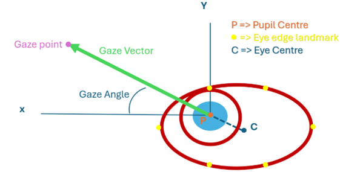

# Real Time Driver State Detection

## Features

- **Face and Iris Detection**: Uses Google's Mediapipe to detect 478 facial keypoints and iris positions.
- **Driver State Classification**: Identifies states like Normal, Tired, Asleep, Looking Away, and Distracted.
- **Gaze Classification**: Calibrated gaze direction estimation for precise monitoring.
- **Real-time Monitoring**: Processes webcam feed in real-time with configurable thresholds.
- **Calibration Support**: Calibrate gaze regions for accurate classification.

## Gaze Classification

For precise gaze direction monitoring, the system supports calibration with two cameras positioned either side of the driver in line with the slide mirrors.

### Calibration Process
1. The gaze vectors is determined by the difference between the centre of the eye and the iris position as shown below.



2. Fixate on each gaze region:
   - Over the right shoulder
   - Right Window
   - Right Mirror
   - Rearview Mirror
   - Looking at the Road Ahead
   - Left Mirror
   - Left Window
   - Over the left shoulder

3. Save calibration data to JSON files for reuse.

[Video Demo of Gaze Classification](./demo/gaze_classification.mp4)

## Installation

### Using pip

```bash
pip install -r requirements.txt
```

## Usage

Navigate to the `driver_state_detection` folder:

```bash
cd driver_state_detection
```

### Basic Usage

```bash
python main.py
```

### With Cameras

```bash
python main.py --camera 1 2
```

### Calibration

Run calibration mode:

```bash
python main.py --camera 1 2 --calibrate --calibration_output cam1.json cam2.json --calibration_audio roi_audio.m4a
```

Load existing calibration:

```bash
python main.py --camera 1 2 --calibration_output cam1.json cam2.json
```

### All Options

```bash
python main.py --help
```

## Project Poster

[View Project Poster](./demo/ProjectPoster.pdf)

## Contributing

Thanks to [MustafaLotfi](https://github.com/MustafaLotfi) for the Mediapipe integration.
Thanks to [Ettore Candeloro](https://github.com/e-candeloro/Driver-State-Detection) for developing Real Time Driver State Detection, from which this work is built upon.


